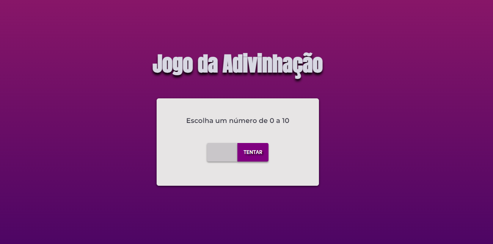
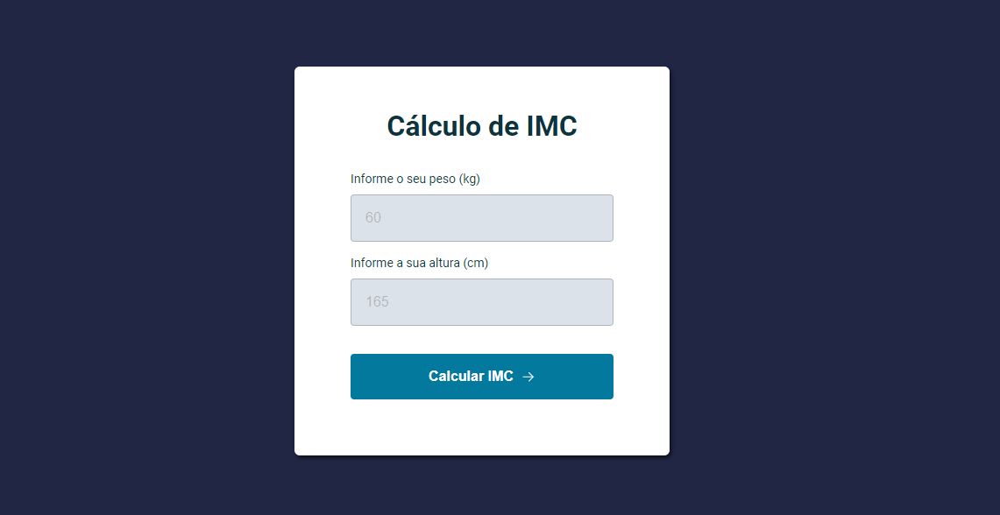
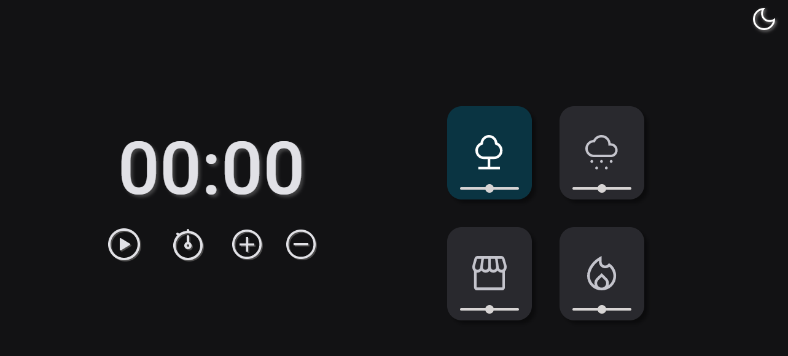

# Projetos | Programa Explorer da Rocketseat

> ### 👩🏻‍💻 Desafio 1: criar um jogo de adivinhação.

 

🔗Acesse o projeto [clicando aqui](https://alineviana.github.io/jogo-adivinhacao/)

📍Repositório: https://github.com/alineviana/jogo-adivinhacao

   

> ### 👩🏻‍💻 Desafio 2: criar uma calculadora de IMC.

 

🔗Acesse o projeto [clicando aqui](https://alineviana.github.io/calculando-imc/)

📍Repositório: https://github.com/alineviana/calculando-imc

   

> ### 👩🏻‍💻 Desafio 3️⃣ : criar um temporizador (FocusTimer - Dark Mode).

 

🔗Acesse o projeto [clicando aqui](https://alineviana.github.io/contador/FocusTimer-DarkMode/)

📍Repositório: https://github.com/alineviana/contador
