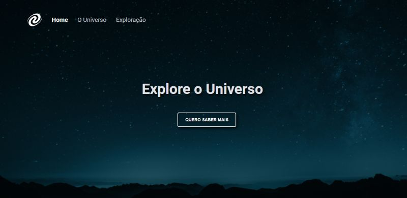

# Projeto SPA | Programa Explorer da Rocketseat

> ### 👩🏻‍💻 Desafio: criar uma SPA (Single Page Application).

 

 

🔗Acesse o projeto [clicando aqui](https://spa-universe-ivory.vercel.app/)

📍Repositório: https://github.com/alineviana/spa-universe

 

> ## 📝 Conceitos estudados

- SPA (Single-Page Application);
- Mapeamento de rotas;
- Assincronismo e promises;
- Orientação a objetos;
- Classes;
- Responsividade.

 

> ## 🖥️ Tecnologias

- HTML5
- CSS3
- JavaScript

